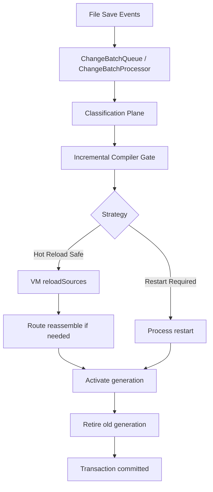
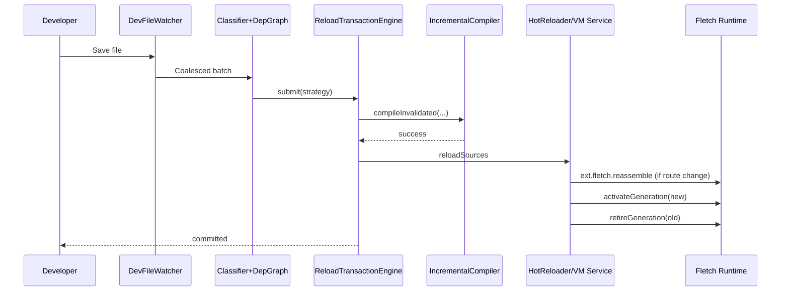

# Hot Reload (Dev Mode)

Fletch hot reload is a transaction-based development loop that applies code changes without restarting your process for most edits.

This page explains:

- how to enable and use hot reload,
- what edits are hot-reload safe vs restart-required,
- the full internal lifecycle (classify, compile, stage, activate, retire),
- how runtime generation draining works,
- how to tune and troubleshoot the system.

## Quick Usage

### 1. Enable Route Reassembly in Your App

Default (backward-compatible): use `app.hotReload(...)`.
Optional advanced runtime hooks: use `configureDevHotReload(...)`.

```dart
import 'dart:io';
import 'package:fletch/fletch.dart';

void registerRoutes(Fletch app) {
  app.get('/ping', (req, res) => res.text('ok'));
  app.get('/version', (req, res) => res.text('v1'));
}

Future<void> main() async {
  final app = Fletch(
    secureCookies: false,
    requestTimeout: const Duration(seconds: 6),
    shutdownTimeout: const Duration(seconds: 3),
  );
  app.hotReload(() => registerRoutes(app));
  registerRoutes(app);

  final port = int.tryParse(Platform.environment['PORT'] ?? '') ?? 3000;
  await app.listen(port, address: InternetAddress.loopbackIPv4);
}
```

Why this matters:

- VM source reload updates code,
- `ext.fletch.reassemble` clears + re-registers routes,
- named handlers pick up new bodies without process restart.

### 2. Start Dev Server

```bash
fletch dev --entry bin/server.dart --watch lib
```

Useful flags:

```bash
fletch dev --entry bin/server.dart \
  --port 3003 \
  --watch lib,routes,controllers \
  --verbose-compiler \
  --compiler-max-recovery-attempts 1 \
  --compiler-max-diagnostics 80 \
  --compiler-recovery-backoff-ms 120
```

### 3. Edit Files Under Watched Directories

On save, the dev server will:

1. coalesce watcher events,
2. classify change strategy,
3. run incremental compile,
4. hot reload when safe,
5. hot restart only when required.

## High-Level Architecture

```text
          File Save Events
                 |
                 v
     +-------------------------+
     | ChangeBatchQueue        |
     | + ChangeBatchProcessor  |
     +-------------------------+
                 |
                 v
     +-------------------------+
     | Classification Plane    |
     | - AST change analyzer   |
     | - dependency graph      |
     | - strategy selection    |
     +-------------------------+
                 |
                 v
     +-------------------------+
     | Compile Gate            |
     | IncrementalCompiler     |
     +-------------------------+
                 |
        +--------+--------+
        |                 |
        v                 v
+----------------+   +----------------+
| Hot Reload     |   | Hot Restart    |
| (VM reload +   |   | (process       |
| route reasm.)  |   | restart path)  |
+----------------+   +----------------+
        |
        v
+----------------------------+
| ReloadTransactionEngine    |
| detected -> ... -> commit  |
+----------------------------+
        |
        v
+----------------------------+
| Runtime Generation Hooks   |
| activate/retire generations|
+----------------------------+
```



## Transaction Lifecycle (Detailed)

Every batch runs as a transaction with explicit phases:

1. `detected`
2. `classifying`
3. `compiling`
4. `staging`
5. `activating`
6. `retiring`
7. terminal: `committed` / `failed` / `aborted`

### Sequence Diagram (Hot Reload Success)

```text
Developer Save
   |
   v
DevFileWatcher -> ChangeBatchProcessor -> ChangeAnalyzer + DependencyGraph
   |
   v
ReloadTransactionEngine.submit(strategy)
   |
   v
IncrementalCompiler.compileInvalidated(...)
   |
   v
HotReloader.reloadSources(isolate)
   |
   v
ext.fletch.reassemble (if route reassemble needed)
   |
   v
ext.fletch.reload.activateGeneration(newGen)
   |
   v
ext.fletch.reload.retireGeneration(oldGen)
   |
   v
ReloadTransactionEngine -> committed
```



### Sequence Diagram (Fallback to Restart)

```text
Developer Save
   |
   v
Classify -> strategy=restartRequired
   |
   v
Transaction: compiling -> staging -> activating
   |
   v
ProcessManager.restart()
   |
   v
Reconnect VM service + restart incremental compiler
   |
   v
activate(newGen) -> retire(oldGen)
   |
   v
Transaction -> committed
```

## Change Strategy Rules

The classifier resolves one strategy per batch:

- `bodyOnlyHotSwap`: function body-only changes, no route graph impact.
- `routeGraphChange`: route registration touched; reload + reassemble routes.
- `containerShapeChange`: DI/container shape changed; migration path (if configured).
- `restartRequired`: entry/config/generated/safety-breaking changes.

Common restart-required triggers:

- `pubspec.yaml` changes,
- `bin/*` entrypoint changes,
- `main.dart` changes,
- generated `*.g.dart` changes,
- structural/breaking AST deltas.

## Runtime Generation Draining

When optional runtime hooks are enabled (`configureDevHotReload(...)`), dev tools coordinate generation transitions across the VM service boundary.

Runtime extensions used:

- `ext.fletch.reassemble`
- `ext.fletch.reload.runtimeState`
- `ext.fletch.reload.activateGeneration`
- `ext.fletch.reload.retireGeneration`

Runtime state tracks:

- active generation id,
- in-flight request counts per generation,
- retiring generations.

Retire behavior:

- waits up to configured timeout for in-flight requests to drain,
- if timeout elapses, forced retire is reported with remaining count.

## Metrics and Observability

The hot reload system emits phase-level metrics (via `ReloadMetricsSink`), including:

- counters:
  - `reload_transactions_total`
  - `reload_compile_failures_total`
  - `reload_activation_failures_total`
  - `reload_rollbacks_total`
- histograms/timers:
  - `reload_detect_ms`
  - `reload_classify_ms`
  - `reload_compile_ms`
  - `reload_stage_ms`
  - `reload_activate_ms`
  - `reload_total_ms`
- gauges:
  - `reload_queue_depth`
  - `reload_inflight_requests`
  - `reload_generation_active_age_ms`

## Performance Expectations

Current measured integration-benchmark ranges (on local dev machines):

- body-only edits: typically tens of milliseconds,
- route-graph edits (with reassemble): slightly higher than body-only,
- restart path: significantly higher than reload path.

Run benchmark integration tests:

```bash
cd packages/fletch_dev_tools
dart test test/integration/reload_latency_benchmark_integration_test.dart -r expanded
```

Look for lines like:

```text
RELOAD_BENCHMARK fixture=body_only samples=12 p50=... p95=...
RELOAD_BENCHMARK fixture=route_graph samples=12 p50=... p95=...
```

## Troubleshooting

### Hot reload not happening

Check:

1. VM service is connected (`🔥 Hot reload enabled` in logs).
2. You are editing watched paths (`--watch`).
3. change was not classified as `restartRequired`.

### Routes not updating after reload

Check:

1. Either `app.hotReload(() => registerRoutes(app)); registerRoutes(app);` is configured, or `configureDevHotReload(...)` is used.
2. route registration is inside the factory function.
3. dev logs show route reassemble for route-graph changes.

### Frequent compile failures

Try:

```bash
fletch dev --entry bin/server.dart \
  --verbose-compiler \
  --compiler-max-recovery-attempts 2 \
  --compiler-max-diagnostics 120 \
  --compiler-recovery-backoff-ms 250
```

### Fallback restarts too common

Likely causes:

- touching generated/config/entry files,
- structural API/signature changes,
- broad invalidation from dependency changes.

## Advanced: Programmatic Dev Server Configuration

If you run dev tools from Dart code:

```dart
final server = FletchDevServer(
  entryPoint: 'bin/server.dart',
  watchDirectories: ['lib', 'routes'],
  verboseCompiler: false,
  compilerMaxRecoveryAttempts: 1,
  compilerMaxDiagnostics: 80,
  compilerRecoveryBackoff: const Duration(milliseconds: 120),
  // Optional: migration policy/hooks and custom metrics sink.
);

await server.start();
```

## Security and Production Notes

- Hot reload is a development capability, not a production deployment mechanism.
- VM service extensions are local privileged control surfaces.
- Keep production environments on normal release/restart workflows.

<div style="display:flex;justify-content:space-between;gap:1rem;align-items:center;margin:2rem 0;">
  <a href="/getting-started/quick-start" style="display:flex;align-items:center;gap:0.4rem;text-decoration:none;color:inherit;">
    <span aria-hidden="true">‹</span>
    <span>🚀 Quick Start</span>
  </a>
  <a href="/advanced/isolated-containers" style="display:flex;align-items:center;gap:0.4rem;text-decoration:none;color:inherit;">
    <span>🧱 Isolated Containers</span>
    <span aria-hidden="true">›</span>
  </a>
</div>
